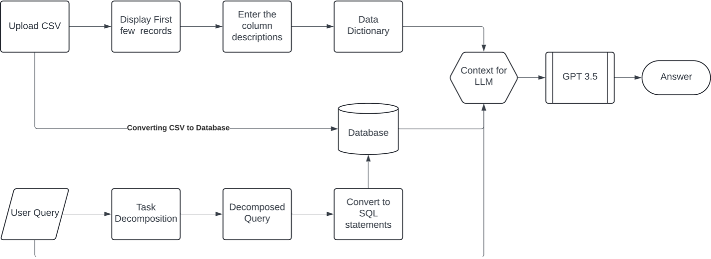
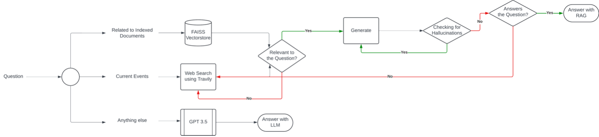

# ExtractLM
 ExtractLM is a RAG application which supports information retrieval from PDFs and CSVs.

 Usage Instructions:

## Download and setup the application:

1. Open Terminal and navigate to your desired folder and clone the repository:

`git clone git@github.com:dhruvvaidh/ExtractLM.git`  

2. Create a new conda environment and Install the required libraries:

`conda create -n env extractlm`
`pip install -r 'requirements.txt'`

3. Setup the environment variables:

In .env.example file, you will have to add your OpenAI API Key and rename this file to .env to create your environment variables

3. Start the application:

`streamlit run main.py`

4. Read the instructions on the main page to get started with the application:

## Chat with CSVs workflow diagram

## Chat with PDFs workflow diagram

